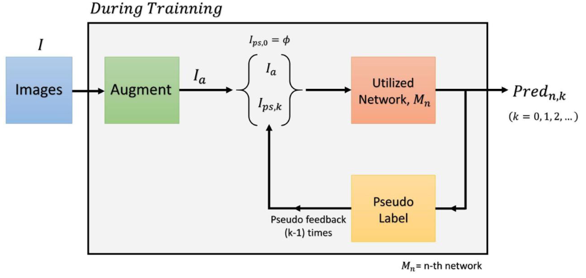
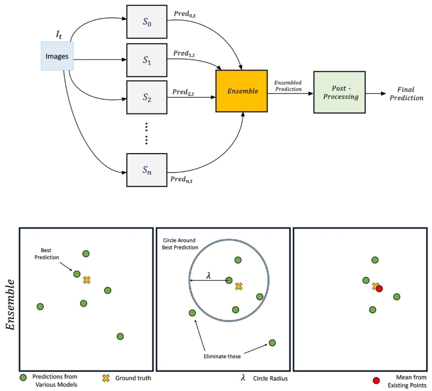

# IEEE Video and Image Processing Cup 2021: Privacy-Preserving In-Bed Human Pose Estimation

## Introduction

This repository is dedicated to the IEEE VIP Cup 2021 competition. Our team "prolestarian2021" achieved 1st rank in test 1, surpassing other top teams. The main challenge revolves around domain adaptation for estimating human pose in various conditions. You can find details about our method in the [Report](./report.pdf). You can also find the checkpoints in [ckpts](./ckpts) folder.

## Method

**Training**:

**Inference**:

**Ensemble**:

## Results

## Output Visualization

## Background

People spend a significant portion of their lives in bed. Modern AI-driven pose estimation has seen tremendous success, but poses challenges when applied to in-bed monitoring due to issues like varying light conditions, occlusions, and privacy concerns.

The 2021 VIP Cup targets a domain adaptation problem for regression focusing on in-bed pose estimation, an area previously unexplored. The goal is to find vision-based solutions for pose estimation under covers without annotations for covered scenarios but ample labeled data for uncovered ones.

## Dataset Description

The Simultaneously-collected multimodal Lying Pose (SLP) dataset features in-bed human poses from 109 participants in both home and hospital settings. Captured in four imaging modalities under varying cover conditions, this challenge focuses on using the LWIR modality to predict poses without labeled covered training data. The dataset can be downloaded on [Kaggle](https://www.kaggle.com/datasets/awsaf49/ieee-vip-cup-2021-train-val-dataset)

### Train + Validation Datasets (80 subjects)

- **Training Set (80 subjects):**
  - Annotated uncovered data from 30 subjects.
  - Unannotated thin-covered data from 25 subjects.
  - Unannotated thick-covered data from 25 subjects.
  
- **Validation Set (10 subjects):**
  - Unannotated thin-covered data from 5 subjects.
  - Unannotated thick-covered data from 5 subjects.

Both LWIR and RGB data, along with an alignment mapping between them, will be provided for these sets.

### Test Dataset (19 subjects: 12 from home, 7 from hospital)

- **Home Setting:**
  - 6 with thin cover.
  - 6 with thick cover.

- **Hospital Setting:**
  - 3 with thin cover.
  - 4 with thick cover.

Only the LWIR modality is provided for the test set, simulating real-world overnight monitoring scenarios where RGB might be unavailable. This test dataset is further split into Test Set 1 and Test Set 2. As LWIR is centered on human figures, no bounding boxes are provided.

## How to Run

For successful execution, follow these guidelines:
1. Ensure internet access.
2. Use an Ubuntu-based OS.
3. Follow the steps in sequence to avoid errors.
4. If faced with an error, restart the session and the entire process.
5. Our codes have been successfully tested on Google Colab, with competition data provided.

### Direct Prediction/Inference:

- Use weights from the 'Google Drive' inside the 'CKPT' Folder. (We use gdown to download the weights for you.)
- Run the [`infer_new.ipynb`](/notebooks/infer_new.ipynb) notebook.

### Training:

- **OPTION 1 - Partial Training:** 
    1. Use [`pseudo.csv`](./pseudo.csv) for faster training.
    2. Train EvoPose2D, Transpose, and LiteHrNet models.
    3. Ensemble the 3 models for final prediction.
- **OPTION 2 - Full Training:** 
    1. Train EvoPose2D to get pseudo labels ([`pseudo.csv`](./pseudo.csv)).
    2. Train TransPose using `pseudo.csv`.
    3. Train LiteHrNet using `pseudo.csv`.
    4. Ensemble the models and generate pseudo labels for the next round.
    5. Repeat steps 1-4 for 10 times.

### Scripts Information:

- **EvoPose2D:** Use the [`model-evopose2d.ipynb`](/notebooks/model-evopose2d.ipynb) Notebook.
- **TransPose:** 
    - Create bboxes with [`VIP21 GenBBOX YOLOv5.ipynb`](/notebooks/VIP21%20GenBBOX%20YOLOv5.ipynb).
    - Use [`VIP21 TransPose H version.ipynb`](/notebooks/VIP21%20TransPose%20H%20version.ipynb) for TransPoseH.
- **LiteHrNet:** For pseudo training, use [`LiteHrNet Pseudo Training Notebook.ipynb`](/notebooks/LiteHrNet%20Pseudo%20Training%20Notebook.ipynb).
- **Ensemble:** Run [`infer_new.ipynb`](/notebooks/infer_new.ipynb) with the updated weights of EvoPose2D, TransPose, and LiteHrNet.